# 🐍 ارتقای بازی مار — از صفر تا حرفه‌ای

این مخزن، **روند پیشرفت** من رو در ساخت یه بازی مار نشون میده.  
از یه نسخه‌ی ساده‌ی ۵۰ خطی، تا یه بازی حرفه‌ای با سوالات ریاضی، صدا، گرافیک و تنظیمات کامل.

---

## 📖 داستان این پروژه

### 🎬 نسخه‌ی اول: اولین قدم (myfirstsnake.py)

اولین باری که یه بازی مار ساختم، فقط یه مربع سبز بود که می‌چرخید و میوه می‌خورد.  
بدون صدا، بدون UI، بدون سوال. فقط یه بازی ساده.

**چی یاد گرفتم:**
- کار با `pygame`
- حلقه‌ی اصلی بازی
- تشخیص برخورد
- حرکت مار

---

### 🧮 نسخه‌ی دوم: اضافه شدن ریاضی (snacke.py)

بعد فکر کردم: «چرا بازی فقط سرگرمی باشه؟ چرا یه چیز آموزشی نسازم؟»  
پس سوالات ریاضی رو اضافه کردم. هر بار که مار به میوه می‌رسید، یه سوال میومد.

**چی یاد گرفتم:**
- پشتیبانی از فارسی با `arabic_reshaper` و `bidi`
- طراحی UI داخل بازی
- مدیریت کلیک کاربر
- نمایش نتیجه‌ی درست/اشتباه با رنگ

---

### 🏆 نسخه‌ی سوم: یه بازی کامل (MYLASTSNAKE.py)

اینجا دیگه یه پروژه‌ی حرفه‌ای ساختم! منو، تنظیمات، صدا، امتیازات، سطوح، کامبو، تایمر، ذرات، متن شناور، و کلی چیز دیگه.

**چی یاد گرفتم:**
- معماری کلاس‌محور (OOP)
- مدیریت چند صفحه (Menu, Settings, Scores, Help, Game)
- ذخیره‌سازی با JSON
- سیستم صدا
- انیمیشن و افکت‌های بصری
- تایمر پویا
- سیستم سطح‌بندی

---

## 📊 مقایسه‌ی نسخه‌ها

| ویژگی | نسخه ۱ | نسخه ۲ | نسخه ۳ |
|--------|---------|---------|---------|
| حرکت مار | ✅ | ✅ | ✅ |
| میوه | ✅ | ✅ | ✅ |
| سوال ریاضی | ❌ | ✅ | ✅ |
| پشتیبانی فارسی | ❌ | ✅ | ✅ |
| منو | ❌ | ❌ | ✅ |
| تنظیمات | ❌ | ❌ | ✅ |
| صدا | ❌ | ❌ | ✅ |
| سطح‌بندی | ❌ | ❌ | ✅ |
| کامبو | ❌ | ❌ | ✅ |
| تایمر | ❌ | ❌ | ✅ |
| ذرات | ❌ | ❌ | ✅ |
| ذخیره امتیاز | ❌ | ❌ | ✅ |

---

## 📸 پیشرفت بصری

### 🎬 نسخه‌ی اول — شروع ساده

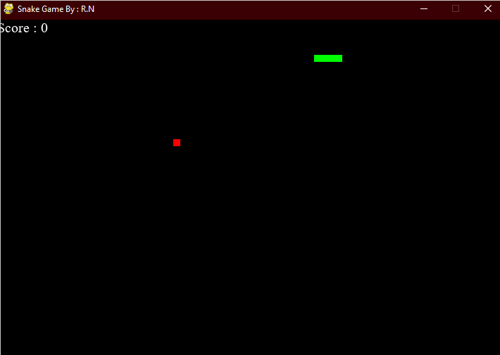

اینجا فقط یه مار ساده بود که میوه می‌خورد. بدون سوال، بدون UI، بدون صدا.

---

### 🧮 نسخه‌ی دوم — اضافه شدن سوالات ریاضی

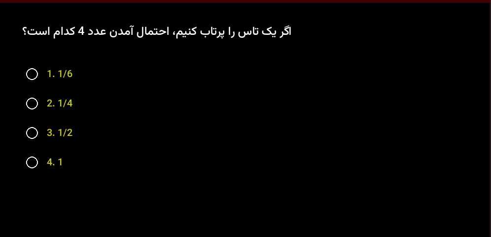

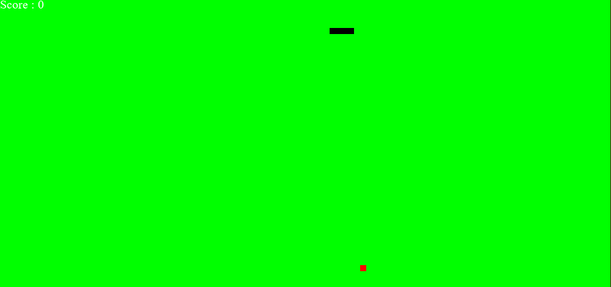

اینجا سوالات ریاضی اضافه شد و پشتیبانی از فارسی.

---

### 🏆 نسخه‌ی نهایی — بازی کامل

**منوی اصلی:**

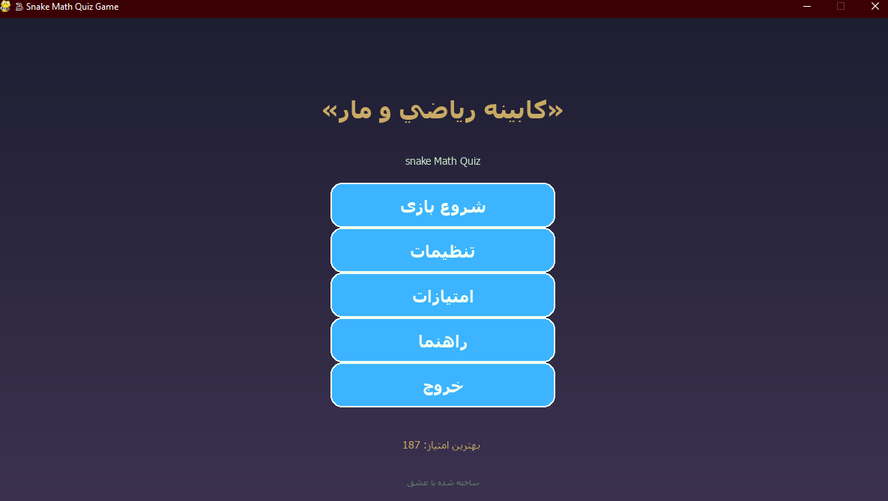

**گیم‌پلی:**

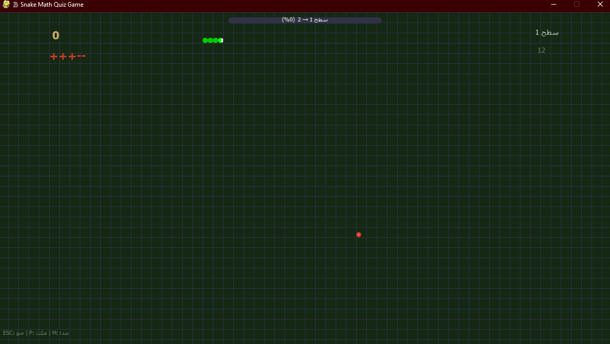

**کارت سوال ریاضی:**

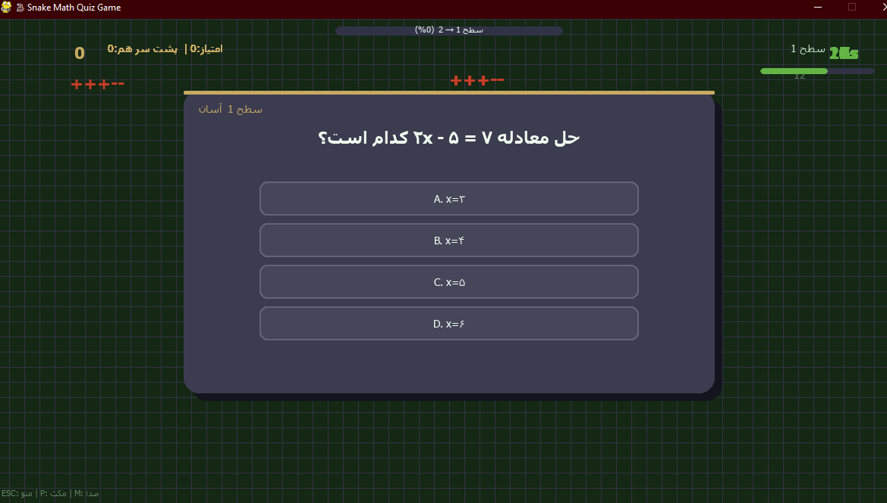

**سطح‌آپ:**

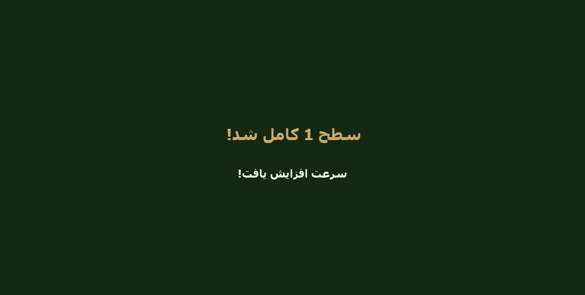

**پایان بازی:**

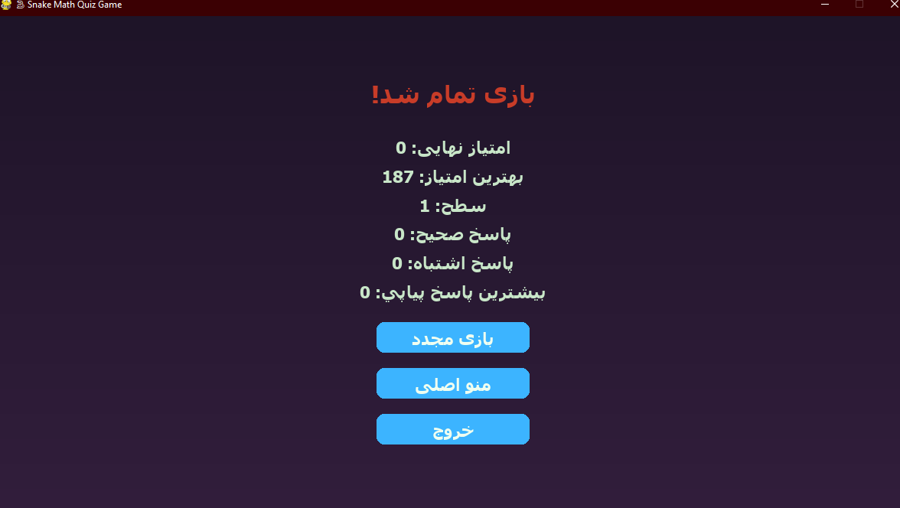

**تنظیمات:**

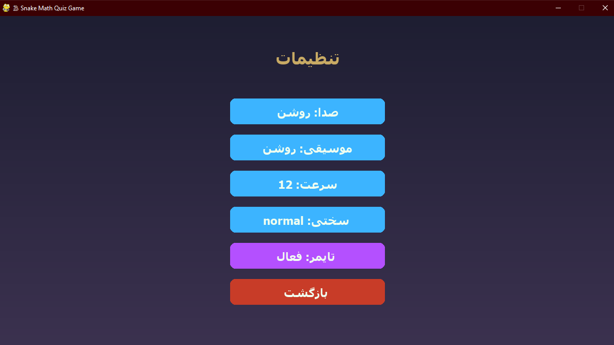

**امتیازات:**

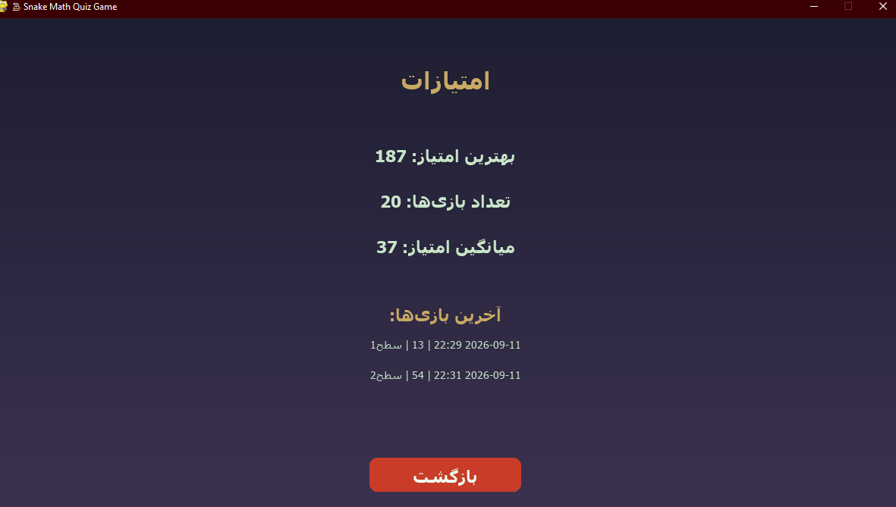

**راهنما:**

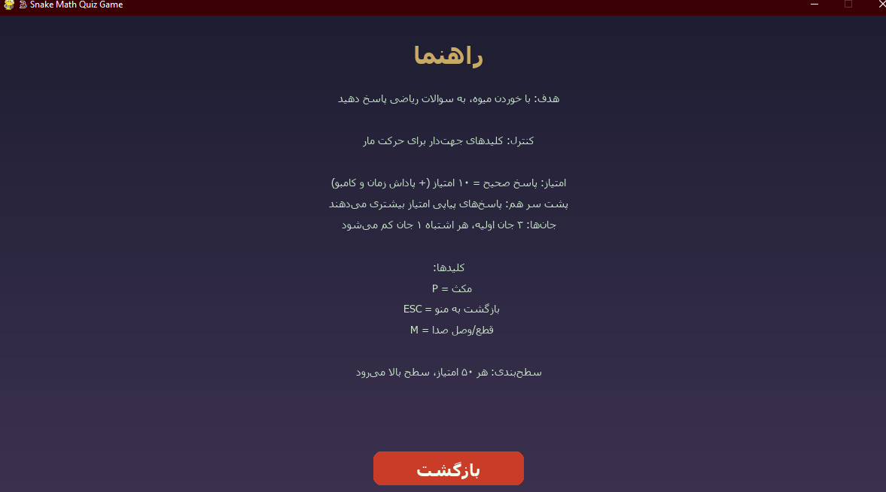

## 🚀 چرا این مخزن رو ساختم؟

چون می‌خواستم نشون بدم که **هیچ‌کس از اول حرفه‌ای نیست.**  
هر برنامه‌نویس بزرگی، از یه چیز ساده شروع کرده.  
و این پروژه، داستان منه.

---

## 👩‍💻 توسعه‌دهنده

**Reyhane Naemi**  
- [GitHub](https://github.com/ReyhaneNaemi)

---

## 🌟 حمایت

اگه از این داستان خوشتان اومد، به مخزن ⭐ بدهید!